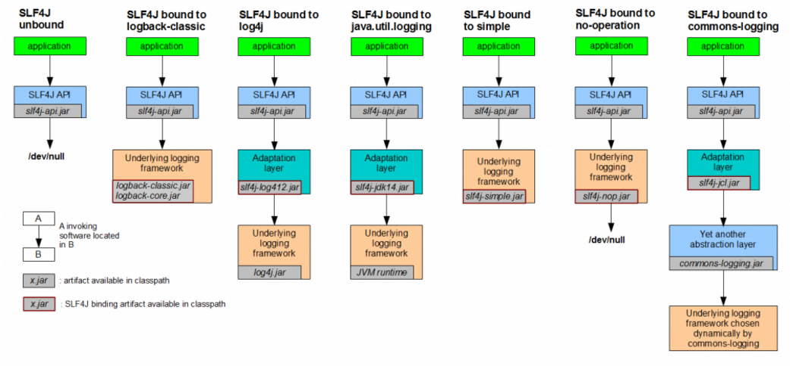

# 日志规范概述

Java中常用的日志组件包括common-logging，Log4j、Logback、slf4j等，各种日志组件都有自己的发展历史和过程，也存在不足。
构建工程的过程中会依赖到不同的组件，各个组件可能依赖了不同的日志组件，如何将各个组件的输出日志统一管理并标准化输出是需要面临的一个问题。
	另外，日志的输出内容中需要包含用户的标识，线程的唯一标识等信息，以便错误的追踪和查找，所以需要统一日志格式，设置日志输出的有效内容和线索。
	平台后台JAVA工程日志中，统一使用slf4j+logback的方式进行日志的记录和输出，通过slf4j对各个日志组件的桥接器，适配不同的记录方式。

同时，采用slf4j和MDC的结合，平台在日志中记录了如用户id，线程调用唯一标识等信息，方便问题的追踪，为运维管理中如ELK方案追踪日志信息提供线索。