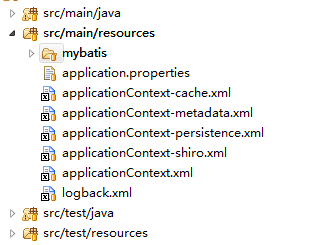

# Spring配置文件与命名规约

平台目前使用Spring版本为4.0.5-RELEASE，结合spring对其它组件和产品进行扩展，建议分模块利用多个spring配置文件进行整合。

1：spring配置文件统一放置在 src/main/resources下；  
2：spring配置文件命名格式为applicationContext-abc.xml；  
3：各个模块的spring配置文件在web.xml中引入或者在spring主配置文件applicationContext.xml中import；

